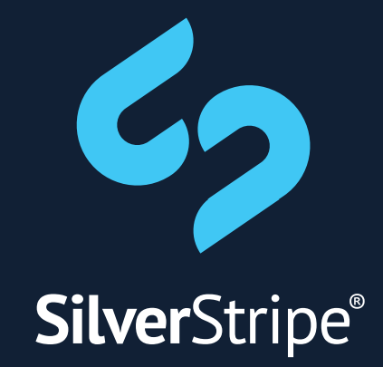

# Money is 
###### not a 
# dirty 
###### word

Note:

Hi. My name is Hamish Friedlander. I work for SilverStripe.

And I love money.

I also love programming. I've been doing it since I was six. I try and do it every day. Every day I don't is worse than 
any day I do. There's almost nothing else  I can think of that is so satisfying. As programmers we form worlds from 
nothing, dragging them from the ether of our thought. It is pure, limitless creation. It is bliss. It is nirvana.

But I love money more. I love eating. I love sleeping in a bed. I love not fearing for tomorrow. I would
murder every one of you if I went without caffeine for more than 6 hours, so my ability to buy flat whites
is pretty key.

So as amazing as programming is, if I had to choose between programming and money, I'd choose money.

Fortunately I'm incredibly privileged, and hopefully everyone here feels this way, to have a job where we
can do what we love and still get paid. So I don't have to choose.
 
▾▾▾▾

# How to give awayme all your code 
### and still turn a
### profitwho cares I have your stuff

Note:

I also love open source. I think the desire to share is innate to all people. I personally would not be a developer
if, when I was learning, people had not made compilers and code examples and tooling free. I think free access to 
information is crucial to expand our economy, societial progress and growth, technological progress and ensure 
nothing less than humanity's survival.  I don't think it's egotistical to say that - that in least in part
I am responsible for the continued existence of mankind.

But still - I love money.

And just like I don't have to choose between programming and money, I don't have to choose between open source
and money. The company I work for, SilverStripe, open sources a lot of our code, and not only do we make money, but I 
think our success is in part _because_ we open source almost everything we do. We make more money because we open source 
our code than we would otherwise. 
 
#### -> Next fragment
 
So this isn't just "how to give away all your stuff", or even "how to give away all your stuff and if you're lucky 
probably afford to eat". This is "how to give away all your stuff and still crush the competition and retire to a house 
made of diamond built on the back of a gigantic robotic golden tiger". Actually, that's my retirement - you can
get something else. One giant robotic golden tiger is awesome, two seems a bit gauche.

▸▸▸▸▸▸▸▸

# The money or the bag?
### How do people select a product - and how do   I get it to be mine?

Note:

*Target: 4:00*

But before I can retire to a life of luxury aboard my obscene and frankly rather disturbing cyborg bling cat mobile home,
I need money. Other people's money. How do I get them to give me that money? 

Whether I'm selling a product, or a service, or indirectly funding through advertising, I need turn those people into
customers. 

Obviously whatever I'm selling needs to solve a problem that these potential customers have got. But it's rare
to be the only competitor in the market - at least until you've become such a success you've crushed the life out of 
all the competition, and get to live the sweet sweet life of a monopolist.

I want any potential customers to choose me, and not those other chumps. So, given a bunch of products that they
might buy, how does a potential customer choose?

▾▾▾▾

# The moolah
### Cost

▾▾▾▾

# The shiny
### Features

▾▾▾▾

# The smile
### Support

▾▾▾▾

# Compare on criteria
### Pick the best

▾▾▾▾

# Nothing so rational

▾▾▾▾

## Costs are harder to compare   than you might expect

- Quote or Estimate?
- Ongoing enhancements
- Training
- Total Cost of Ownership

▾▾▾▾

## Features are fungible

- Hard to match business requirements to existing features
- Marginal cost of code approaches zero
- Too many cooks

▾▾▾▾

## Future support isn't measurable

- Contracts and SLAs are failure management, not control
- Managing support issues is itself support
- Purchaser has poor understanding of internal requirements

▾▾▾▾

## Criteria are excluders, not selectors 

### They act as a band pass filter

▸▸▸▸▸▸▸▸

# So how _do_ &nbsp;clients select products?

Note:

*Target: 8:00*

▾▾▾▾

# Awareness

▾▾▾▾

# Trust

▾▾▾▾

# Reputation

▸▸▸▸▸▸▸▸

# Anecdotes that prove without any doubt that I am right

Note:

*Target: 12:00*

▾▾▾▾

# No one ever got fired for buying IBM

▾▾▾▾

# GitLab versus GitHub

▾▾▾▾

# UK CMS RFPs

▸▸▸▸▸▸▸▸

# More reps, less weight
### So how exactly do you build reputation

Note:

*Target: 16:00*

▾▾▾▾
 
# Eat Organic
### Hunter/gatherer reputation 

▾▾▾▾

# Burn that cash
### Aggressive marketing can force-grow reputation

▾▾▾▾

# Silver Spoon
### The reputation 1%

▾▾▾▾

# Human microphone
### Build a community to talk about you behind your back

▾▾▾▾

# Your community will take your reputation farther than you can yourself

▾▾▾▾

# If you build it, they won't come
### Turns out just building a field isn't enough

▾▾▾▾

# Give them something to talk about
### Open source is a touch point and a piece of real shared ownership for your community

▸▸▸▸▸▸▸▸

# The open source spectrum

&nbsp;

<ul class="timeline">
<li>None</li>
<li>Consumption</li>
<li>Engagement</li>
<li>Peripheral</li>
<li>Open core</li>
<li class="last">Complete</li>
</ul>

&nbsp;

Note:

*Target: 20:00*

So now we've wended our way to open source. You need the reputation to get the money, you get the reputation by
open sourcing.

But what do I mean by open sourcing? Open sourcing isn't a binary thing, which you either are or you aren't. There
are lots of ways you can interact with open source.

The least of which is - well, no interaction. You might simply not use open source software, or you might be
fundamentally opposed.

▸▸▸▸▸▸▸▸

# You complete me
### You can open source everything, and still make money

Note:

*Target: 24:00*

What I want to do is convince you to go "Complete". It's certainly SilverStripe's goal. There are some
things we don't open source, but normally the question is "is there a reason we shouldn't open source this",
not "is there a reason we should".

▾▾▾▾

# Hamish, you're   a moron
### I've just given away all my code. People might love me, but what are they buying?

▾▾▾▾

## What the hand, dare seize the fire?

### SilverStripe, that's who

Note:

These days as I briefly mentioned at the beginning of this talk I work for SilverStripe. It's an awesome company to 
work for, and open sources a lot of code.

In fact, in addition to being the name of the company I work for, SilverStripe is also the name of an open source PHP web 
development framework and CMS we open source. It's our most well known open source offering, although we also open source
a lot of other code we develop.

Despite doing that we've grown to be an international company, with offices in three countries and nearly 70 staff.

Incidentally, if you recognise the reference in this slide, you win a prize. And that prize is the sense of smug
satisfaction at being objectively better than the people sitting near your that don't recognise it.

▾▾▾▾

# Small beginnings
### A legend is born

▾▾▾▾

# Digital transformations
### Autobots, roll out

▾▾▾▾

# SilverStripe Platform
### 100% Noise Cancelling

▾▾▾▾

# Knowledge worker
### Selling houses, not hammers

▸▸▸▸▸▸▸▸

# I have a doubt
### What stops competitors simply taking your source, and building their own reputation?

Note:

*Target: 28:00*

▾▾▾▾

# Do I know you?
### You're not as big as you think you are

▾▾▾▾

# What's this garbage?
### Without reputation, people won't even take your work for free

▾▾▾▾

# Learn to surf
### Reputation only needs to be a little ahead of adoption

▸▸▸▸▸▸▸▸

# When to not
### There are no absolutes. Except this one.

Note:

*Target: 32:00*

▾▾▾▾

# When you're   not very good
### Amplifiers are content-agnostic and will amplify bad reputation too

▾▾▾▾

# When you're   not in control
### You want a community, not a mob

▾▾▾▾

# When you're   doing things differently
### Impulse purchases, single engagements,   inelastic markets

▾▾▾▾

# There's the quick and the dead
### If you choose not to take advantage of a benefit, and a competitor does, guess which one you are?

▸▸▸▸▸▸▸▸

# Sorry, can you   repeat that? 
### I was checking Facebook

Note:

*Target: 36:00*

▾▾▾▾

# You live and die by your reputation, not by your code

▾▾▾▾

# Open source builds reputation

▾▾▾▾

# SilverStripe will crush you and   stand alone on an   tower of money

▾▾▾▾

# Thank you

 | 
------ | ------
@hafriedlander | @silverstripe

